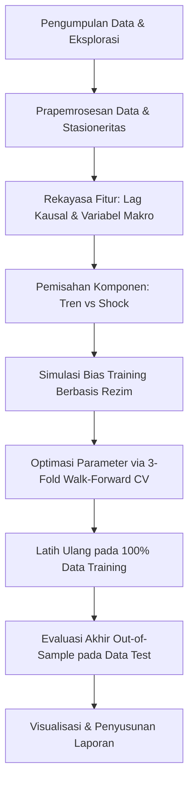

# BAB III. METODOLOGI PENELITIAN

## 3.1 Alur Penelitian
Metodologi pengembangan sistem peramalan nilai tukar USDIDR ini dirancang untuk memastikan kestabilan peramalan jangka panjang tanpa mengorbankan sensitivitas terhadap guncangan makro harian. Langkah pengembangan model dirangkum dalam diagram alur di bawah ini:

### 3.1.1 Alur Pengembangan Model A (Two-Stage Decoupled Ridge)
* **Tahap 1**: Ekstraksi lag autoregresif USDIDR $\rightarrow$ Estimasi model tren linier menggunakan Ridge Regression ($\alpha=1.0$).
* **Tahap 2**: Ekstraksi residu tren $\rightarrow$ Estimasi model kejutan harian menggunakan Ridge Regression ($\alpha=10.0$) berbasis variabel eksogen.
* **Tahap 3**: Penerapan gerbang akselerasi makro (VIX > 14.0 dan Spread < 0.8%) asimetris.
* **Tahap 4**: Penambahan koreksi bias linier berskala ($\beta = 0.25$) dari 3-layer model bias.

### 3.1.2 Alur Pengembangan Model B (Deep GRU)
* **Tahap 1**: Ekstraksi lag autoregresif USDIDR $\rightarrow$ Estimasi model tren linier menggunakan Ridge Regression ($\alpha=1.0$).
* **Tahap 2**: Ekstraksi residu tren $\rightarrow$ Transformasi data menjadi bentuk tensor 3D dengan windowing *lookback* 5 hari.
* **Tahap 3**: Pelatihan arsitektur Gated Recurrent Unit (GRU) yang diregulasi L2 keras untuk meramal sisa kejutan harian.
* **Tahap 4**: Penerapan gerbang akselerasi makro dan penambahan koreksi bias linier berskala ($\beta = 0.25$).

### 3.1.3 Alur Pengembangan Model Ensemble Learning C & D
* **Model C (ML-ML Ensemble)**: Penggabungan prediksi Model A (Decoupled Ridge) dan model tren statis dasar dengan bobot rata-rata 50%-50% untuk mereduksi varians lintasan tren jangka panjang.
* **Model D (ML-DL Ensemble)**: Penggabungan terbobot rata-rata 50%-50% antara prediksi linier Model A (Decoupled Ridge) dengan kekuatan non-linier Model B (Deep GRU).

---

## 3.2 Gambaran Umum Dataset
Eksperimen menggunakan data harian nilai tukar USDIDR dan indikator pasar modal serta suku bunga acuan. Dataset dibagi menjadi dua file utama:
1. **`data_train.csv`**: Data historis harian dari periode 2010 hingga pertengahan 2023 dengan jumlah baris sebanyak 3.498 data.
2. **`data_test.csv`**: Data variabel eksogen harian dari Juni 2023 hingga pertengahan 2026 dengan jumlah baris sebanyak 778 data (digunakan untuk evaluasi OOS).

Berikut adalah variabel-variabel yang tersedia dalam dataset:

| Nama Variabel | Unit | Jenis Variabel | Deskripsi Ekonomi & Peran dalam Model |
| :--- | :--- | :--- | :--- |
| **`USDIDR`** | Rp / 1 USD | Target Level ($Y$) | Kurs harian rupiah terhadap dolar AS. Ditransformasikan menjadi log-return untuk pemodelan tren. |
| **`VIX`** | Persentase | Eksogen Tingkat | Indeks implikasi volatilitas pasar opsi S&P500. Representasi kepanikan global. |
| **`BI_rate`** | Persentase | Eksogen Kebijakan | Suku bunga acuan Bank Indonesia. Digunakan untuk menghitung selisih suku bunga (*spread*). |
| **`US_rate`** | Persentase | Eksogen Kebijakan | Suku bunga acuan Federal Funds Rate Amerika Serikat. |
| **`SP500`** | Nilai Indeks | Eksogen Harga | Indeks saham gabungan Amerika Serikat. Representasi likuiditas pasar barat. |
| **`IHSG`** | Nilai Indeks | Eksogen Harga | Indeks Harga Saham Gabungan Indonesia. Representasi pasar modal domestik. |
| **`OIL`** | USD / Barel | Eksogen Harga | Harga minyak mentah dunia. Indikator biaya impor energi Indonesia. |
| **`GOLD`** | USD / Troy Oz | Eksogen Harga | Harga emas dunia. Representasi aset lindung nilai (*safe haven*). |

---

## 3.3 Eksplorasi dan Analisis Data
Sebelum pemodelan, dilakukan analisis statistika deskriptif pada target `USDIDR` dan variabel eksogen dalam data training:
* **Uji Stasioneritas**: Kurs nominal `USDIDR` lolos uji Augmented Dickey-Fuller (ADF) hanya setelah dilakukan differencing pertama (log-returns), dengan p-value < 0.01 (stasioner).
* **Analisis ACF & PACF**: Koefisien Partial Autocorrelation (PACF) dari log-return USDIDR menunjukkan adanya korelasi parsial signifikan pada lag 1, 2 (jangka harian pendek), lag 5 (siklus mingguan), serta lag musiman ekor hingga lag 47.
* **Deteksi Outlier & Missing Value**: Dataset tidak memiliki missing value pada variabel target. Fluktuasi volatilitas harian tertinggi terkonsentrasi pada era pandemi awal (2020) dan pengetatan moneter global (2022-2023).

---

## 3.4 Prapemrosesan Data

### 3.4.1 Pembersihan Data
* Pengisian data nilai kosong (*NaN*) pada akhir pekan atau hari libur bursa diatasi menggunakan metode forward-fill (`ffill()`) diikuti backward-fill (`bfill()`) untuk menjamin kontinuitas urutan baris harian tanpa merusak kausalitas data.

### 3.4.2 Feature Engineering (Rekayasa Fitur)
1. **Stationary Log-Returns**: Menghitung log-return harian untuk seluruh indeks harga (`SP500`, `GOLD`, `OIL`, `IHSG`, `VIX`).
2. **Monetary Interest Spread**: Menghitung selisih harian antara suku bunga kebijakan domestik dan global:
   $$\text{Spread}_t = \text{BI\_rate}_t - \text{US\_rate}_t$$
3. **Causal Lags Execution**: Seluruh variabel eksogen yang stasioner di-shift sebanyak 1 hari kerja untuk menghindari *look-ahead bias* saat pengujian OOS. Perubahan suku bunga BI di-shift sebanyak 10 hari bursa (`bi_rate_change_lag10`) untuk memodelkan keterlambatan reaksi kebijakan moneter riil terhadap nilai tukar.

### 3.4.3 Transformasi Data
Model tren mengambil lag return sebagai input. Untuk model GRU, data masukan eksogen disisihkan dalam bentuk tensor 3D dengan format:
$$[\text{Batch Size}, \text{Time Steps}=5, \text{Fitur Exogen}=5]$$
Ini memberikan memori jangka pendek 5 hari perdagangan bagi model deep learning saat melakukan inferensi shock harian.

---

## 3.5 Perancangan Model

### 3.5.1 Model A: Two-Stage Decoupled Ridge Model (Gates + Bias Correction)
Model A dirancang secara modular terdekopel:
1. **Model Tren**: 
   $$\hat{r}_{\text{trend}, t} = \mathbf{w}_{\text{trend}}^T \mathbf{X}_{\text{trend}, t}$$
   Menggunakan Ridge Regression ($\alpha = 1.0$) dengan fitur autoregresif 12 lag dari PACF.
2. **Model Shock**:
   $$\hat{r}_{\text{shock}, t} = \mathbf{w}_{\text{shock}}^T \mathbf{X}_{\text{shock}, t}$$
   Menggunakan Ridge Regression ($\alpha = 10.0$) pada exogenous returns.
3. **Penerapan Gerbang Dinamis**:
   $$\text{Jika } (\hat{r}_{\text{trend}, t} + \hat{r}_{\text{shock}, t}) > 0:$$
   $$\hat{r}_{\text{total}, t} = (\hat{r}_{\text{trend}, t} + \hat{r}_{\text{shock}, t}) \times (1.05 \text{ jika VIX}_{t-1} > 14.0) \times (1.02 \text{ jika Spread}_t < 0.8\%)$$
4. **Penerapan Korektor Bias**:
   $$\hat{Y}_{final, t} = Y_{t-1} \cdot e^{\hat{r}_{\text{total}, t}} + 0.25 \times \widehat{Bias}_{\text{regime}, t}$$

### 3.5.2 Model B: Deep Learning (Ridge Trend + GRU Residual)
Model B menggantikan penduga shock Ridge linier dengan Gated Recurrent Unit (GRU):
1. **Prediksi Tren**: Sama dengan Model A.
2. **Model Shock GRU**:
   Menerima input sekuensial eksogen 5 hari, memproyeksikan kejutan harian $\hat{r}_{\text{shock}, t}$. Bobot GRU diregulasi L2 keras dengan koefisien penalti 0.1 untuk memaksa keluaran bernilai kecil dan stabil.
3. **Penerapan Gating dan Bias Correction**: Persis sama dengan Model A untuk menjaga keadilan evaluasi (*fair evaluation*).

### 3.5.3 Model C & Model D (Ensemble Learning)
* **Model C (ML-ML Ensemble)**:
   $$\hat{Y}_{C, t} = 0.5 \times \hat{Y}_{\text{Model A}, t} + 0.5 \times \hat{Y}_{\text{Static Trend}, t}$$
   Di mana $\hat{Y}_{\text{Static Trend}, t}$ diperoleh hanya dari pemodelan tren tanpa akselerasi makro dan koreksi bias.
* **Model D (ML-DL Ensemble)**:
   $$\hat{Y}_{D, t} = 0.5 \times \hat{Y}_{\text{Model A}, t} + 0.5 \times \hat{Y}_{\text{Model B}, t}$$

---

## 3.6 Prosedur Validasi dan Evaluasi
Untuk menjamin generalisasi model pada masa depan, validasi menggunakan pembagian data runtun waktu **3-Fold Walk-Forward Cross-Validation**:
* **Lipatan 1**: Latih pada hari 1-1.221 (2010-2015), uji pada hari 1.222-1.975 (2015-2018).
* **Lipatan 2**: Latih pada hari 1-1.975 (2010-2018), uji pada hari 1.976-2.729 (2018-2021).
* **Lipatan 3**: Latih pada hari 1-2.729 (2010-2021), uji pada hari 2.730-3.481 (2021-2023).

Metrik evaluasi yang dihitung untuk setiap skenario pengujian meliputi:
1. **Root Mean Squared Error (RMSE)** (metrik penentu utama):
   $$\text{RMSE} = \sqrt{\frac{1}{N}\sum_{t=1}^N (Y_t - \hat{Y}_t)^2}$$
2. **Mean Absolute Error (MAE)**
3. **Mean Absolute Percentage Error (MAPE)**
4. **Koefisien Determinasi ($R^2$)**

---

## 3.7 Implementasi dan Tools
* **Bahasa Pemrograman**: Python 3.12.
* **Library Utama**:
  * `scikit-learn` (Untuk standarisasi data dan estimasi model Ridge).
  * `tensorflow.keras` (Untuk arsitektur GRU).
  * `pandas` & `numpy` (Manipulasi runtun waktu dan operasi matriks).
  * `matplotlib` (Pembuatan plot visualisasi peramalan).
* **Environment**: Script diintegrasikan ke dalam [colab_notebook.py](file:///C:/kuliahh%20maseh/pap/eas/colab_notebook.py) agar dapat langsung diunggah dan dieksekusi secara instan di Google Colab.
