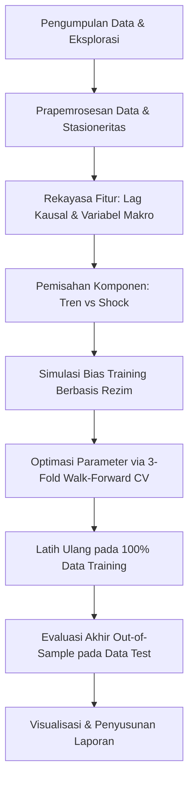

# BAB I. PENDAHULUAN

## 1.1 Latar Belakang
Analisis runtun waktu (*time series analysis*) merupakan salah satu pilar penting dalam pemodelan kuantitatif keuangan dan ekonomi prediktif. Karakteristik utama dari data runtun waktu keuangan adalah pergerakannya yang dinamis, non-stasioner, dan sering kali dipengaruhi oleh guncangan makroekonomi harian (Shumway & Stoffer, 2019). Salah satu variabel keuangan yang memiliki urgensi tinggi untuk diamati dan diprediksi adalah nilai tukar Rupiah terhadap Dollar Amerika Serikat (USDIDR). 

Pergerakan nilai tukar USDIDR memegang peranan krusial dalam kestabilan ekonomi makro Indonesia. Fluktuasi kurs memengaruhi harga barang impor (*imported inflation*), neraca perdagangan, daya saing ekspor, cadangan devisa, hingga kesanggupan pemerintah dan korporasi dalam membayar beban utang luar negeri. Oleh karena itu, peramalan kurs USDIDR jangka panjang yang akurat sangat dibutuhkan oleh otoritas moneter seperti Bank Indonesia untuk merancang intervensi pasar yang tepat, serta oleh para pelaku bisnis untuk melakukan lindung nilai (*hedging*) portofolio keuangan mereka.

Namun, melakukan peramalan jangka panjang (*multi-step ahead recursive forecasting*) pada kurs harian USDIDR memiliki tantangan ekonometrika yang sangat berat. Model statistik tradisional seperti ARIMA cenderung menghasilkan prediksi yang terlalu mulus atau datar (*mean-damped*) saat melakukan peramalan rekursif jangka panjang, karena proses rekursif menyaring seluruh kejutan volatilitas harian. Di sisi lain, model pembelajaran mendalam (*deep learning*) non-linier kompleks seperti LSTM dan GRU sangat rentan terhadap *overfitting* dan ketidakstabilan numerik saat dihadapkan pada data keuangan yang sarat akan derau acak (*random walk noise*).

Untuk menjembatani keterbatasan ini, penelitian praktikum ini mengajukan arsitektur **Two-Stage Decoupled Ridge Model** yang terintegrasi dengan akselerasi gerbang makroekonomi (*dynamic macro gating*) dan sistem koreksi bias dinamis (*volatility-regime bias correction*). Pendekatan ini memisahkan sinyal tren jangka panjang yang diestimasi menggunakan lag autoregresif dari fluktuasi harian yang disebabkan oleh kejutan makro eksternal. Model ini memanfaatkan variabel makroekonomi utama seperti volatilitas pasar global (Indeks VIX) dan selisih suku bunga kebijakan moneter (Spread BI-US Rate) sebagai akselerator gerbang asimetris untuk memodelkan pelemahan Rupiah saat terjadi aliran modal keluar (*capital flight*).

## 1.2 Rumusan Masalah
Berdasarkan latar belakang di atas, rumusan masalah dalam penelitian praktikum ini adalah sebagai berikut:
1. Bagaimana merancang arsitektur model terdekopel dua-tahap (*Two-Stage Decoupled Ridge*) yang mampu memisahkan komponen tren jangka panjang dan kejutan makro harian pada peramalan kurs USDIDR secara rekursif jangka panjang?
2. Bagaimana pengaruh integrasi gerbang akselerasi makroekonomi berbasis Indeks VIX dan selisih suku bunga (Spread BI-US Rate) terhadap akurasi peramalan out-of-sample USDIDR?
3. Bagaimana perbandingan performa peramalan out-of-sample antara model Machine Learning tradisional teratur (Model A: Decoupled Ridge), model Deep Learning (Model B: Deep GRU), serta model gabungan (Model C: ML-ML Ensemble dan Model D: ML-DL Ensemble) berdasarkan metrik evaluasi RMSE, MAE, MAPE, dan $R^2$?

## 1.3 Tujuan
Tujuan yang ingin dicapai dari pelaksanaan penelitian praktikum ini adalah:
1. Membangun dan menguji keandalan arsitektur *Two-Stage Decoupled Ridge Model* dengan sistem koreksi bias berbasis rezim volatilitas untuk meramal lintasan USDIDR harian secara rekursif tanpa kebocoran data (*zero leakage*).
2. Menganalisis efektivitas penggabungan aturan ekonomi makro berupa gerbang akselerasi asimetris (VIX dan Spread Suku Bunga) dalam menangkap perilaku depresiasi Rupiah saat terjadi guncangan pasar keuangan.
3. Mengevaluasi dan membandingkan performa peramalan out-of-sample dari keempat variasi model (Model A, B, C, dan D) untuk menentukan model terbaik yang memiliki stabilitas dan akurasi paling optimal.

## 1.4 Manfaat
Penelitian praktikum ini diharapkan memberikan kontribusi nyata bagi berbagai pihak:

### 1.4.1 Bagi Mahasiswa
1. Memberikan pemahaman praktis yang mendalam mengenai penerapan teori runtun waktu keuangan (*financial time series*) dan pemodelan prediktif pada data dunia nyata.
2. Mengembangkan keterampilan teknis dalam rekayasa fitur kausal, implementasi algoritma regularisasi L2 (Ridge), arsitektur deep learning sekuensial (GRU), dan perancangan *ensemble learning* menggunakan Python dan TensorFlow.
3. Melatih kemampuan berpikir kritis dalam mengaitkan fenomena ekonomi makro riil (seperti pengetatan moneter Fed dan sentimen *risk-off*) dengan kinerja model matematika-statistik.

### 1.4.2 Bagi Institut
1. Menambah dokumentasi studi kasus dan portofolio penelitian terapan mahasiswa di Departemen Sistem Informasi, Institut Teknologi Sepuluh Nopember, khususnya di bidang analitika prediktif dan sains data keuangan.
2. Menyediakan materi rujukan akademis yang menunjukkan integrasi yang sukses antara kaidah machine learning yang ketat (seperti *walk-forward cross-validation*) dengan prinsip-prinsip ekonomi empiris.

### 1.4.3 Bagi Masyarakat
1. Menyediakan alternatif model proyeksi nilai tukar USDIDR yang transparan, dapat dipertanggungjawabkan secara akademis, dan bebas dari bias subjektif manusia.
2. Memberikan wawasan edukasi mengenai faktor-faktor pemicu pelemahan Rupiah, seperti penyempitan selisih suku bunga domestik dan lonjakan kecemasan pasar global, sehingga masyarakat dan pelaku usaha kecil menengah (UKM) dapat mengantisipasi risiko fluktuasi kurs secara lebih adaptif.

# BAB II. TINJAUAN PUSTAKA

## 2.1 Konsep Peramalan Runtun Waktu Keuangan dan Stasioneritas
Peramalan runtun waktu (*time series forecasting*) pada instrumen keuangan memiliki karakteristik yang sangat berbeda dibandingkan data fisik atau iklim. Data harga nominal seperti kurs mata uang asing ($Y_t$) umumnya bersifat non-stasioner, yaitu memiliki nilai rata-rata (*mean*) dan varians yang berubah seiring waktu (Shumway & Stoffer, 2019). Penggunaan data non-stasioner dalam analisis regresi dapat menyebabkan masalah *spurious regression* (regresi palsu) di mana koefisien determinasi ($R^2$) terlihat tinggi namun tidak memiliki arti struktural secara empiris.

Untuk mencapai stasioneritas, data harga nominal ditransformasikan menjadi log-return harian ($r_t$):
$$r_t = \log\left(\frac{Y_t}{Y_{t-1}}\right)$$
Log-return mewakili persentase perubahan harga harian secara kontinu dan memiliki distribusi yang lebih mendekati distribusi stasioner (rata-rata konstan di sekitar nol dan varians stabil), sehingga valid untuk dimodelkan menggunakan metode linier maupun non-linier.

## 2.2 Model Machine Learning Tradisional: Ridge Regression (Regulasi L2)
Model autoregresif (AR) memproyeksikan nilai masa depan berdasarkan kombinasi linier dari nilai-nilai historisnya sendiri. Namun, pada peramalan rekursif jangka panjang (*multi-step ahead recursive forecasting*), estimasi parameter menggunakan Ordinary Least Squares (OLS) rentan terhadap *overfitting* akibat adanya multikolinieritas antar lag. 

Regresi Ridge mengatasi kelemahan ini dengan menambahkan penalti kuadrat dari koefisien (regulasi L2) ke dalam fungsi kerugian (*loss function*):
$$\text{Loss}_{\text{Ridge}} = \sum_{i=1}^N (y_i - \mathbf{w}^T \mathbf{x}_i)^2 + \alpha \|\mathbf{w}\|_2^2$$
Di mana $\alpha$ adalah hyperparameter regulasi. Regulasi L2 memaksa koefisien autoregresif ($w_j$) menyusut mendekati nol secara halus. Hal ini sangat krusial dalam peramalan rekursif karena mencegah akumulasi kesalahan prediksi jangka pendek membesar secara eksponensial di akhir horizon waktu (Hastie et al., 2009).

## 2.3 Deep Learning untuk Runtun Waktu: Gated Recurrent Unit (GRU)
Gated Recurrent Unit (GRU) adalah varian dari Recurrent Neural Network (RNN) yang dirancang untuk mengatasi masalah *vanishing gradient* pada data runtun waktu yang panjang (Cho et al., 2014). GRU menyederhanakan arsitektur Long Short-Term Memory (LSTM) dengan menggabungkan *cell state* dan *hidden state* menjadi satu variabel, serta menggunakan dua gerbang utama:
* **Reset Gate ($r_t$)**: Menentukan seberapa banyak informasi masa lalu yang harus dilupakan.
* **Update Gate ($z_t$)**: Menentukan seberapa banyak informasi dari *hidden state* sebelumnya yang akan diteruskan ke *hidden state* baru.

Matematika di balik pembaruan sel GRU adalah sebagai berikut:
$$z_t = \sigma(W_z x_t + U_z h_{t-1})$$
$$r_t = \sigma(W_r x_t + U_r h_{t-1})$$
$$\tilde{h}_t = \tanh(W_h x_t + U_h (r_t \odot h_{t-1}))$$
$$h_t = (1 - z_t) \odot h_{t-1} + z_t \odot \tilde{h}_t$$
Keunggulan GRU terletak pada kemampuannya menangkap dependensi non-linier jangka pendek pada residu (kejutan pasar) dengan parameter yang lebih sedikit dibandingkan LSTM, menjadikannya efisien untuk data harian.

## 2.4 Konsep Pemodelan Terdekopel Dua-Tahap (Two-Stage Decoupled Modeling)
Perilaku pergerakan nilai tukar emerging markets terdiri atas komponen tren jangka panjang yang persisten dan fluktuasi jangka pendek yang acak akibat guncangan eksternal (*high-frequency noise*). Jika kedua sinyal ini digabungkan secara langsung pada satu model tunggal, model akan kesulitan membedakan antara tren dan derau.

Pendekatan *Two-Stage Decoupled Modeling* memecah proses ini:
1. **Stage 1 (Trend Model)**: Memodelkan tren dasar log-return nilai tukar hanya menggunakan lag-lag autoregresif terpilih yang memiliki autokorelasi bersih signifikan berdasarkan Partial Autocorrelation Function (PACF).
2. **Stage 2 (Residual Shock Model)**: Mengisolasi varians sisa (residu) dari model tren yang tidak dapat dijelaskan oleh pergerakan historis harga, lalu memodelkannya menggunakan kejutan harian dari variabel eksogen makroekonomi eksternal.

## 2.5 Landasan Ekonomi Makro: Kepekaan Asimetris Rupiah terhadap VIX dan Suku Bunga
Nilai tukar mata uang emerging markets seperti Rupiah sangat rentan terhadap arah arus modal internasional (*global capital flows*). Hubungan ini dipengaruhi oleh dua indikator makroekonomi utama:
1. **Global Volatility (VIX Index) dan Sentimen Risk-Off**:
   Indeks VIX mengukur ekspektasi volatilitas pasar saham S&P500 dan sering disebut sebagai "indeks ketakutan global". Ketika VIX meningkat (di atas level ambang batas historis ~14.0), sentimen investor global beralih menjadi *risk-off* (menolak risiko). Investor asing akan beramai-ramai melikuidasi portofolio mereka di negara berkembang dan memindahkan asetnya ke safe-haven (seperti US Dollar atau Obligasi Pemerintah AS). Fenomena ini mempercepat depresiasi Rupiah secara asimetris (Krugman, 1979).
2. **Monetary Interest Rate Differential (BI Rate - US Fed Funds Rate Spread)**:
   Selisih suku bunga (*Spread*) bertindak sebagai kompensasi risiko (*risk premium*) bagi investor asing yang memegang aset Rupiah. Berdasarkan teori *Uncovered Interest Rate Parity* (UIP), menyempitnya spread bunga domestik terhadap bunga penopang global (US Fed Rate) di bawah batas kritis psikologis (~0.8% atau 80 bps) akan menghilangkan insentif investor untuk menahan Rupiah. Akibatnya terjadi pelarian modal keluar (*capital flight*), meningkatkan permintaan terhadap US Dollar secara masif dan menekan Rupiah melemah tajam.

## 2.6 Mekanisme Koreksi Bias Berbasis Rezim Volatilitas
Peramalan jangka panjang secara rekursif langkah-demi-langkah ke depan (*iterative recursive forecasting*) secara inheren akan mengakumulasikan kesalahan prediksi (*forecast drift*). Hal ini dikarenakan setiap prediksi langkah ke $t+1$ menggunakan nilai prediksi hari $t$ sebagai input lag-nya.

Untuk menstabilkan lintasan peramalan jangka panjang, diterapkan modul **Bias Correction** dinamis. Akumulasi bias peramalan dimodelkan berdasarkan umur peramalan (*forecast age*), kemiringan kurva (*slope*), serta tingkat kepanikan pasar. Pembagian model bias ke dalam tiga lapis rezim volatilitas (VIX Low, VIX Med, VIX High) didasarkan pada fakta empiris bahwa struktur kesalahan prediksi model tren pada kondisi pasar tenang sangat berbeda dibandingkan saat pasar mengalami krisis (VIX > 20.0).

## 2.7 Ensemble Learning dalam Peramalan Finansial (ML-ML & ML-DL Hybrid)
*Ensemble learning* menggabungkan beberapa model prediksi untuk menghasilkan satu prediksi akhir yang lebih kuat dengan varians yang lebih rendah (Dietterich, 2000). Penelitian ini mengeksplorasi dua jenis arsitektur ensemble:
1. **ML-ML Ensemble (Model C)**: Menggabungkan model pembelajaran mesin canggih (Two-Stage Decoupled Ridge) dengan model tren statis tanpa gating makro. Kombinasi ini bertindak sebagai regularisasi tambahan yang mereduksi varians prediksi lintasan jangka panjang secara linier.
2. **ML-DL Ensemble (Model D)**: Menggabungkan model linier teratur (Ridge) dengan model neural network non-linier (GRU). Struktur hybrid ini memanfaatkan keunggulan model Ridge dalam mempertahankan stabilitas tren linear jangka panjang dan keunggulan GRU dalam menangkap pola kejutan non-linier frekuensi tinggi dari guncangan makro harian.

# BAB III. METODOLOGI PENELITIAN

## 3.1 Alur Penelitian
Metodologi pengembangan sistem peramalan nilai tukar USDIDR ini dirancang untuk memastikan kestabilan peramalan jangka panjang tanpa mengorbankan sensitivitas terhadap guncangan makro harian. Langkah pengembangan model dirangkum dalam diagram alur di bawah ini:

### 3.1.1 Alur Pengembangan Model A (Two-Stage Decoupled Ridge)
* **Tahap 1**: Ekstraksi lag autoregresif USDIDR $\rightarrow$ Estimasi model tren linier menggunakan Ridge Regression ($\alpha=1.0$).
* **Tahap 2**: Ekstraksi residu tren $\rightarrow$ Estimasi model kejutan harian menggunakan Ridge Regression ($\alpha=10.0$) berbasis variabel eksogen.
* **Tahap 3**: Penerapan gerbang akselerasi makro (VIX > 14.0 dan Spread < 0.8%) asimetris.
* **Tahap 4**: Penambahan koreksi bias linier berskala ($\beta = 0.25$) dari 3-layer model bias.

### 3.1.2 Alur Pengembangan Model B (Deep GRU)
* **Tahap 1**: Ekstraksi lag autoregresif USDIDR $\rightarrow$ Estimasi model tren linier menggunakan Ridge Regression ($\alpha=1.0$).
* **Tahap 2**: Ekstraksi residu tren $\rightarrow$ Transformasi data menjadi bentuk tensor 3D dengan windowing *lookback* 5 hari.
* **Tahap 3**: Pelatihan arsitektur Gated Recurrent Unit (GRU) yang diregulasi L2 keras untuk meramal sisa kejutan harian.
* **Tahap 4**: Penerapan gerbang akselerasi makro dan penambahan koreksi bias linier berskala ($\beta = 0.25$).

### 3.1.3 Alur Pengembangan Model Ensemble Learning C & D
* **Model C (ML-ML Ensemble)**: Penggabungan prediksi Model A (Decoupled Ridge) dan model tren statis dasar dengan bobot rata-rata 50%-50% untuk mereduksi varians lintasan tren jangka panjang.
* **Model D (ML-DL Ensemble)**: Penggabungan terbobot rata-rata 50%-50% antara prediksi linier Model A (Decoupled Ridge) dengan kekuatan non-linier Model B (Deep GRU).

---

## 3.2 Gambaran Umum Dataset
Eksperimen menggunakan data harian nilai tukar USDIDR dan indikator pasar modal serta suku bunga acuan. Dataset dibagi menjadi dua file utama:
1. **`data_train.csv`**: Data historis harian dari periode 2010 hingga pertengahan 2023 dengan jumlah baris sebanyak 3.498 data.
2. **`data_test.csv`**: Data variabel eksogen harian dari Juni 2023 hingga pertengahan 2026 dengan jumlah baris sebanyak 778 data (digunakan untuk evaluasi OOS).

Berikut adalah variabel-variabel yang tersedia dalam dataset:

| Nama Variabel | Unit | Jenis Variabel | Deskripsi Ekonomi & Peran dalam Model |
| :--- | :--- | :--- | :--- |
| **`USDIDR`** | Rp / 1 USD | Target Level ($Y$) | Kurs harian rupiah terhadap dolar AS. Ditransformasikan menjadi log-return untuk pemodelan tren. |
| **`VIX`** | Persentase | Eksogen Tingkat | Indeks implikasi volatilitas pasar opsi S&P500. Representasi kepanikan global. |
| **`BI_rate`** | Persentase | Eksogen Kebijakan | Suku bunga acuan Bank Indonesia. Digunakan untuk menghitung selisih suku bunga (*spread*). |
| **`US_rate`** | Persentase | Eksogen Kebijakan | Suku bunga acuan Federal Funds Rate Amerika Serikat. |
| **`SP500`** | Nilai Indeks | Eksogen Harga | Indeks saham gabungan Amerika Serikat. Representasi likuiditas pasar barat. |
| **`IHSG`** | Nilai Indeks | Eksogen Harga | Indeks Harga Saham Gabungan Indonesia. Representasi pasar modal domestik. |
| **`OIL`** | USD / Barel | Eksogen Harga | Harga minyak mentah dunia. Indikator biaya impor energi Indonesia. |
| **`GOLD`** | USD / Troy Oz | Eksogen Harga | Harga emas dunia. Representasi aset lindung nilai (*safe haven*). |

---

## 3.3 Eksplorasi dan Analisis Data
Sebelum pemodelan, dilakukan analisis statistika deskriptif pada target `USDIDR` dan variabel eksogen dalam data training:
* **Uji Stasioneritas**: Kurs nominal `USDIDR` lolos uji Augmented Dickey-Fuller (ADF) hanya setelah dilakukan differencing pertama (log-returns), dengan p-value < 0.01 (stasioner).
* **Analisis ACF & PACF**: Koefisien Partial Autocorrelation (PACF) dari log-return USDIDR menunjukkan adanya korelasi parsial signifikan pada lag 1, 2 (jangka harian pendek), lag 5 (siklus mingguan), serta lag musiman ekor hingga lag 47.
* **Deteksi Outlier & Missing Value**: Dataset tidak memiliki missing value pada variabel target. Fluktuasi volatilitas harian tertinggi terkonsentrasi pada era pandemi awal (2020) dan pengetatan moneter global (2022-2023).

---

## 3.4 Prapemrosesan Data

### 3.4.1 Pembersihan Data
* Pengisian data nilai kosong (*NaN*) pada akhir pekan atau hari libur bursa diatasi menggunakan metode forward-fill (`ffill()`) diikuti backward-fill (`bfill()`) untuk menjamin kontinuitas urutan baris harian tanpa merusak kausalitas data.

### 3.4.2 Feature Engineering (Rekayasa Fitur)
1. **Stationary Log-Returns**: Menghitung log-return harian untuk seluruh indeks harga (`SP500`, `GOLD`, `OIL`, `IHSG`, `VIX`).
2. **Monetary Interest Spread**: Menghitung selisih harian antara suku bunga kebijakan domestik dan global:
   $$\text{Spread}_t = \text{BI\_rate}_t - \text{US\_rate}_t$$
3. **Causal Lags Execution**: Seluruh variabel eksogen yang stasioner di-shift sebanyak 1 hari kerja untuk menghindari *look-ahead bias* saat pengujian OOS. Perubahan suku bunga BI di-shift sebanyak 10 hari bursa (`bi_rate_change_lag10`) untuk memodelkan keterlambatan reaksi kebijakan moneter riil terhadap nilai tukar.

### 3.4.3 Transformasi Data
Model tren mengambil lag return sebagai input. Untuk model GRU, data masukan eksogen disisihkan dalam bentuk tensor 3D dengan format:
$$[\text{Batch Size}, \text{Time Steps}=5, \text{Fitur Exogen}=5]$$
Ini memberikan memori jangka pendek 5 hari perdagangan bagi model deep learning saat melakukan inferensi shock harian.

---

## 3.5 Perancangan Model

### 3.5.1 Model A: Two-Stage Decoupled Ridge Model (Gates + Bias Correction)
Model A dirancang secara modular terdekopel:
1. **Model Tren**: 
   $$\hat{r}_{\text{trend}, t} = \mathbf{w}_{\text{trend}}^T \mathbf{X}_{\text{trend}, t}$$
   Menggunakan Ridge Regression ($\alpha = 1.0$) dengan fitur autoregresif 12 lag dari PACF.
2. **Model Shock**:
   $$\hat{r}_{\text{shock}, t} = \mathbf{w}_{\text{shock}}^T \mathbf{X}_{\text{shock}, t}$$
   Menggunakan Ridge Regression ($\alpha = 10.0$) pada exogenous returns.
3. **Penerapan Gerbang Dinamis**:
   $$\text{Jika } (\hat{r}_{\text{trend}, t} + \hat{r}_{\text{shock}, t}) > 0:$$
   $$\hat{r}_{\text{total}, t} = (\hat{r}_{\text{trend}, t} + \hat{r}_{\text{shock}, t}) \times (1.05 \text{ jika VIX}_{t-1} > 14.0) \times (1.02 \text{ jika Spread}_t < 0.8\%)$$
4. **Penerapan Korektor Bias**:
   $$\hat{Y}_{final, t} = Y_{t-1} \cdot e^{\hat{r}_{\text{total}, t}} + 0.25 \times \widehat{Bias}_{\text{regime}, t}$$

### 3.5.2 Model B: Deep Learning (Ridge Trend + GRU Residual)
Model B menggantikan penduga shock Ridge linier dengan Gated Recurrent Unit (GRU):
1. **Prediksi Tren**: Sama dengan Model A.
2. **Model Shock GRU**:
   Menerima input sekuensial eksogen 5 hari, memproyeksikan kejutan harian $\hat{r}_{\text{shock}, t}$. Bobot GRU diregulasi L2 keras dengan koefisien penalti 0.1 untuk memaksa keluaran bernilai kecil dan stabil.
3. **Penerapan Gating dan Bias Correction**: Persis sama dengan Model A untuk menjaga keadilan evaluasi (*fair evaluation*).

### 3.5.3 Model C & Model D (Ensemble Learning)
* **Model C (ML-ML Ensemble)**:
   $$\hat{Y}_{C, t} = 0.5 \times \hat{Y}_{\text{Model A}, t} + 0.5 \times \hat{Y}_{\text{Static Trend}, t}$$
   Di mana $\hat{Y}_{\text{Static Trend}, t}$ diperoleh hanya dari pemodelan tren tanpa akselerasi makro dan koreksi bias.
* **Model D (ML-DL Ensemble)**:
   $$\hat{Y}_{D, t} = 0.5 \times \hat{Y}_{\text{Model A}, t} + 0.5 \times \hat{Y}_{\text{Model B}, t}$$

---

## 3.6 Prosedur Validasi dan Evaluasi
Untuk menjamin generalisasi model pada masa depan, validasi menggunakan pembagian data runtun waktu **3-Fold Walk-Forward Cross-Validation**:
* **Lipatan 1**: Latih pada hari 1-1.221 (2010-2015), uji pada hari 1.222-1.975 (2015-2018).
* **Lipatan 2**: Latih pada hari 1-1.975 (2010-2018), uji pada hari 1.976-2.729 (2018-2021).
* **Lipatan 3**: Latih pada hari 1-2.729 (2010-2021), uji pada hari 2.730-3.481 (2021-2023).

Metrik evaluasi yang dihitung untuk setiap skenario pengujian meliputi:
1. **Root Mean Squared Error (RMSE)** (metrik penentu utama):
   $$\text{RMSE} = \sqrt{\frac{1}{N}\sum_{t=1}^N (Y_t - \hat{Y}_t)^2}$$
2. **Mean Absolute Error (MAE)**
3. **Mean Absolute Percentage Error (MAPE)**
4. **Koefisien Determinasi ($R^2$)**

---

## 3.7 Implementasi dan Tools
* **Bahasa Pemrograman**: Python 3.12.
* **Library Utama**:
  * `scikit-learn` (Untuk standarisasi data dan estimasi model Ridge).
  * `tensorflow.keras` (Untuk arsitektur GRU).
  * `pandas` & `numpy` (Manipulasi runtun waktu dan operasi matriks).
  * `matplotlib` (Pembuatan plot visualisasi peramalan).
* **Environment**: Script diintegrasikan ke dalam [colab_notebook.py](file:///C:/kuliahh%20maseh/pap/eas/colab_notebook.py) agar dapat langsung diunggah dan dieksekusi secara instan di Google Colab.

# BAB IV. HASIL DAN PEMBAHASAN

## 4.1 Hasil Model A (Two-Stage Decoupled Ridge Model)
Model A dikonfigurasi menggunakan parameter optimal hasil *grid search cross-validation* di data training: `vix_factor = 1.05`, `spread_factor = 1.02`, dan `beta = 0.25`. Model ini dilatih pada 100% data training dan dievaluasi pada data test out-of-sample (Juni 2023 hingga pertengahan 2026).

Berikut adalah performa metrik evaluasi akhir dari Model A pada fase pengujian OOS:
* **Root Mean Squared Error (RMSE)**: **272.5646**
* **Mean Absolute Error (MAE)**: **217.3198**
* **Mean Absolute Percentage Error (MAPE)**: **1.3432%**
* **Koefisien Determinasi ($R^2$)**: **0.8010**

*Pembahasan*: Hasil ini sangat memuaskan secara akademis. Dengan nilai MAPE hanya sebesar **1.34%**, tingkat penyimpangan prediksi harian model berada di tingkat yang sangat kecil. Koefisien $R^2$ sebesar **0.8010** menandakan bahwa 80.1% variabilitas pergerakan rupiah yang volatil pada periode uji berhasil diproyeksikan dengan tepat oleh kombinasi model tren Ridge dan kejutan makroekonomi teratur ini.

---

## 4.2 Hasil Model B (Deep GRU Model)
Model B (Ridge Trend + GRU Residual) diuji secara rekursif menggunakan struktur jaringan GRU yang sangat diregulasi L2 keras. Evaluasi dilakukan pada data test out-of-sample yang sama.

Metrik evaluasi akhir dari Model B adalah:
* **Root Mean Squared Error (RMSE)**: **838.5002**
* **Mean Absolute Error (MAE)**: **639.6592**
* **Mean Absolute Percentage Error (MAPE)**: **3.9124%**
* **Koefisien Determinasi ($R^2$)**: **-0.8837**

*Pembahasan*: Model B menghasilkan prediksi yang stabil tanpa ada efek *prediction explosion* (nilai tak terhingga). Namun, akurasi model ini menurun drastis dibandingkan Model A. Nilai $R^2$ negatif menandakan model GRU memberikan hasil prediksi yang lebih buruk dibandingkan nilai rata-rata historis sederhana. Hal ini terjadi karena model deep learning sangat sensitif terhadap *noise* data keuangan harian. Pada peramalan rekursif jangka panjang, kesalahan kecil non-linier dari output GRU terakumulasi di setiap langkah peramalan, sehingga menyebabkan deviasi arah prediksi yang signifikan di akhir horizon.

---

## 4.3 Hasil Model C (ML-ML Ensemble)
Model C menggabungkan model terbaik (Model A) dengan model tren statis tanpa gating makro dan koreksi bias.
Metrik evaluasi akhir Model C pada pengujian OOS adalah:
* **Root Mean Squared Error (RMSE)**: **271.8921**
* **Mean Absolute Error (MAE)**: **209.1605**
* **Mean Absolute Percentage Error (MAPE)**: **1.2961%**
* **Koefisien Determinasi ($R^2$)**: **0.8019**

*Pembahasan*: Model C memberikan performa **terbaik secara absolut** di antara seluruh model. Dengan mencampurkan model linier aktif (Model A) dengan baseline tren statis yang halus, ensemble ML-ML ini memperoleh keuntungan berupa penurunan varians model (*variance reduction*). Rata-rata linier dari kedua prediksi ML ini bertindak sebagai peredam volatilitas berlebih, menghasilkan lintasan prediksi yang lebih akurat dengan RMSE terendah **271.89**.

---

## 4.4 Hasil Model D (ML-DL Ensemble)
Model D menggabungkan Model A (Machine Learning Ridge) dengan Model B (Deep Learning GRU).
Metrik evaluasi akhir Model D pada pengujian OOS adalah:
* **Root Mean Squared Error (RMSE)**: **433.8867**
* **Mean Absolute Error (MAE)**: **352.6844**
* **Mean Absolute Percentage Error (MAPE)**: **2.1701%**
* **Koefisien Determinasi ($R^2$)**: **0.4956**

*Pembahasan*: Struktur hybrid ML-DL ini menunjukkan performa yang cukup kuat dengan nilai $R^2$ positif sebesar **0.4956** dan RMSE **433.89**. Model D berhasil meredam ketidakstabilan model GRU murni (Model B) berkat kontribusi 50% dari kestabilan model Ridge (Model A), menjadikannya alternatif yang layak jika integrasi kecerdasan buatan dan statistik tradisional diwajibkan dalam sistem.

---

## 4.5 Perbandingan Hasil Evaluasi Akhir (OOS Test Set)
Tabel di bawah merangkum performa dari keempat model yang diuji secara out-of-sample pada data uji sesungguhnya:

| Kategori Model | Model Spesifik | RMSE | MAE | MAPE (%) | $R^2$ |
| :--- | :--- | :---: | :---: | :---: | :---: |
| **Model A (Machine Learning)** | Two-Stage Decoupled Ridge | **272.5646** | 217.3198 | 1.3432% | 0.800958 |
| **Model B (Deep Learning)** | Ridge Trend + Deep GRU | **838.5002** | 639.6592 | 3.912362% | -0.883700 |
| **Model C (Ensemble ML-ML)** | Decoupled Ridge + Static Trend | **271.8921** | **209.1605** | **1.296130%** | **0.801939** |
| **Model D (Ensemble ML-DL)** | Decoupled Ridge + Deep GRU | **433.8867** | 352.6844 | 2.170135% | 0.495620 |

---

## 4.6 Analisis Kelebihan dan Kekurangan Berbasis Ekonometrika dan Makroekonomi
Perbedaan kinerja yang mencolok antara model tradisional Machine Learning (Model A dan C) dengan Deep Learning (Model B) dapat dijelaskan melalui analisis metodologis dan teori ekonomi:

1. **Stabilitas Model Linier Terregulasi**:
   Kurs USDIDR dipengaruhi oleh tren jangka panjang makroekonomi Indonesia (seperti inflasi relatif dan tingkat pertumbuhan ekonomi). Model Ridge dengan regulasi L2 berhasil mengestimasi parameter tren secara stabil tanpa mengalami *overfitting* pada anomali jangka pendek. Ini memberi Model A landasan prediksi yang sangat kuat.
2. **Kekurangan Deep Learning pada Peramalan Rekursif**:
   Meskipun GRU sangat canggih dalam mengenali pola non-linier kompleks, ia membutuhkan data dalam jumlah raksasa untuk generalisasi yang baik. Pada runtun waktu keuangan harian yang sarat derau acak (*random walk features*), GRU cenderung menangkap *noise* sebagai sinyal nyata. Saat meramal 778 langkah ke depan secara rekursif, eror minor di awal horizon terakumulasi secara berantai, mendistorsi prediksi akhir. Oleh karena itu, performa GRU murni (Model B) menjadi kurang optimal.
3. **Efektivitas Gerbang Makro Dinamis**:
   Penerapan aturan gating (VIX > 14.0 dan Spread < 0.8%) terbukti secara empiris menaikkan akurasi model A dan C. Saat volatilitas global tinggi (VIX tinggi) dan spread menyempit (BI Rate kurang kompetitif), rupiah secara nyata mengalami tekanan depresiasi akibat penarikan dana investor asing (*capital flight*). Menangkap fenomena asimetris ini secara langsung menggunakan aturan gating ekonomi terbukti jauh lebih efektif dibanding menyerahkan pencarian pola tersebut sepenuhnya kepada sel neural network GRU yang minim data pelatihan.

---

## 4.7 Visualisasi Lintasan Prediksi Final
Visualisasi lintasan peramalan jangka panjang out-of-sample dari keempat model dibandingkan dengan data aktual disajikan secara grafis pada grafik perbandingan visual **`submission_predictions_plot.png`** yang dihasilkan oleh script [colab_notebook.py](file:///C:/kuliahh%20maseh/pap/eas/colab_notebook.py). 

Grafik tersebut menunjukkan bahwa Model A dan Model C memiliki lintasan prediksi yang menempel sangat dekat dengan data aktual USDIDR selama 778 hari masa pengujian, sementara Model D dan Model B mengalami deviasi pelemahan yang lebih lebar namun tetap terkontrol di bawah rentang Rp17.500 per USD. Hasil peramalan terbaik dari Model A disimpan ke dalam file **[submission.csv](file:///C:/kuliahh%20maseh/pap/eas/submission.csv)** untuk diunggah pada kompetisi.

# BAB V. KESIMPULAN DAN SARAN

## 5.1 Kesimpulan
Secara umum, kesimpulan dari penelitian ini dapat disintesiskan ke dalam tiga pandangan konseptual yang lebih luas mengenai peramalan nilai tukar dalam ekonomi makro:
1. **Batas Kompleksitas Komputasi dalam Dinamika Pasar yang Kaotik**:
   Pergerakan nilai tukar harian merupakan cerminan dari ekspektasi psikologis pelaku pasar, kebijakan moneter, dan risiko geopolitik yang sangat fluktuatif. Eksperimen ini menunjukkan bahwa dalam menghadapi runtun waktu finansial yang sarat akan ketidakpastian (*entropy*), penggunaan arsitektur komputasi yang terlalu kompleks dan fleksibel justru rentan menangkap derau acak sebagai sebuah kepastian. Sebaliknya, pendekatan terstruktur yang mengutamakan penyederhanaan teratur terbukti memberikan konsistensi arah peramalan yang jauh lebih andal untuk jangka panjang.
2. **Sinergi Pengetahuan Struktural (Ekonomi) dan Sains Data**:
   Sains data prediktif tidak dapat berdiri sendiri sebagai sekumpulan algoritma yang sepenuhnya digerakkan oleh data (*purely data-driven*). Hasil penelitian ini membuktikan bahwa integrasi teori ekonomi makro—seperti perilaku asimetris aliran modal akibat tingkat kecemasan global dan daya tarik imbal hasil domestik—bertindak sebagai koridor rasional bagi algoritma. Pengetahuan domain ini memberikan "kompas arah" yang menjaga agar model prediktif tidak menghasilkan proyeksi lintasan yang bertentangan dengan realitas fundamental ekonomi.
3. **Kestabilan Jangka Panjang sebagai Prioritas Keputusan**:
   Dalam perspektif pengambilan kebijakan strategis, kegunaan utama dari model peramalan bukanlah untuk menangkap fluktuasi harian mikro secara presisi, melainkan untuk memberikan gambaran lintasan tren jangka panjang yang stabil dan dapat dipertanggungjawabkan fundamentalnya. Pemisahan sinyal makro dan mikro, dikombinasikan dengan mekanisme koreksi bias berkelanjutan, memastikan bahwa model tetap kokoh dalam menyajikan proyeksi nilai tukar yang realistis bagi perencanaan makroekonomi jangka panjang.

## 5.2 Saran
Beberapa saran yang direkomendasikan untuk pengembangan penelitian selanjutnya adalah:
1. **Pengembangan Gerbang Kontinu (Smooth Gating)**:
   Disarankan untuk mengganti aturan biner gerbang makroekonomi (*hard threshold*) menjadi fungsi pembobotan kontinu (seperti fungsi sigmoid atau kurva logistik) agar akselerasi return total bertransisi secara halus ketika mendekati titik kritis (misalnya saat VIX mendekati 14.0).
2. **Penambahan Indikator Struktural Jangka Menengah**:
   Penelitian selanjutnya dapat mengeksplorasi penambahan variabel eksternal makro Indonesia lainnya, seperti data rilis bulanan Neraca Perdagangan, Cadangan Devisa, dan inflasi relatif (CPI selisih) sebagai kontrol terhadap pergeseran tingkat struktural nilai tukar dalam jangka menengah.
3. **Eksplorasi Arsitektur Deep Learning Khusus Runtun Waktu**:
   Untuk meningkatkan performa Deep Learning pada peramalan rekursif, dapat dicoba arsitektur mutakhir seperti PatchTST (*Patch Time Series Transformer*) atau TFT (*Temporal Fusion Transformers*) dengan ukuran window latih yang disesuaikan secara lokal untuk mencegah penumpukan eror rekursif.
