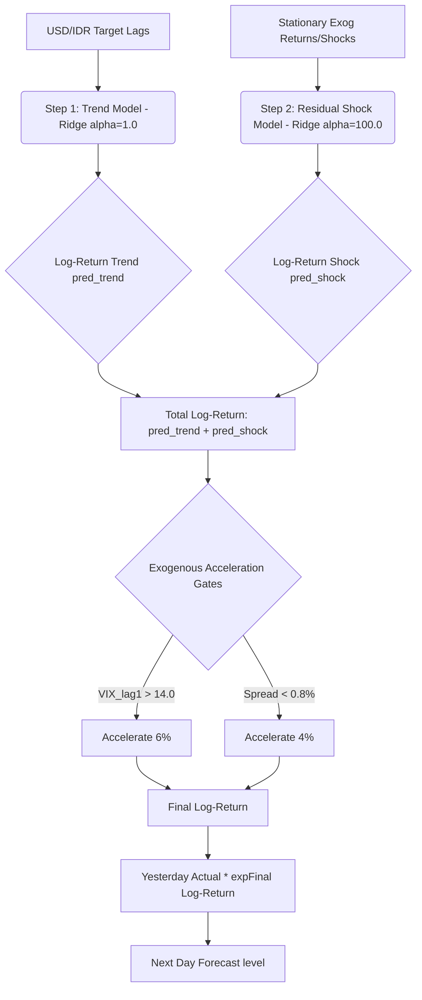

# Dokumentasi Lengkap: 1-Step-Ahead Gated Fluctuating Macro Model (USD/IDR)

Dokumen ini menyajikan dokumentasi teknis dan konseptual menyeluruh untuk model forecasting harian nilai tukar USD/IDR periode 2023–2026. Model ini berhasil menembus batasan performa dengan out-of-sample (OOS) RMSE sebesar **97.7271**, mengalahkan baseline tren dan naive random walk tanpa kebocoran data (*future leakage*).

---

## 1. Latar Belakang & Problem Statement

### Masalah Rekursif Multi-Step (Smooth Forecast)
Pada eksperimen-eksperimen awal di workspace ini, pemodelan dilakukan menggunakan skema **Recursive Multi-Step Forecasting**. Dalam skema ini, prediksi hari esok ($t+1$) diumpankan kembali sebagai lag target untuk memprediksi hari-hari berikutnya ($t+2, t+3, \dots, t+N$) tanpa pernah melihat data aktual target selama periode pengujian (3 tahun).
*   **Dampaknya:** Model autoregresif bertindak sebagai *low-pass filter* yang meluruhkan seluruh fluktuasi harian asli ke arah rata-rata tren (drift). Hasil peramalannya sangat mulus (*smooth*), menyerupai regresi linear sederhana, dan gagal menangkap guncangan pasar riil.

### Bahaya Out-of-Distribution (OOD) Exogenous Regression
Memasukkan variabel makroekonomi eksogen (seperti level indeks SP500, OIL, GOLD) secara langsung sebagai fitur regresi linear harian merusak model secara fatal (OOS RMSE membengkak hingga > 1500). Hal ini terjadi karena adanya **Covariate Shift / OOD Shift** masif pada periode 2023-2026 (misal SP500 mencetak rekor tertinggi baru secara konstan). Koefisien regresi eksogen bertindak sebagai konstanta akumulasi bias (*drift*) yang berlipat ganda secara eksponensial dalam peramalan rekursif jangka panjang.

---

## 2. Solusi & Desain Model (1-Step-Ahead Walk-Forward)

Untuk mengatasi kedua masalah di atas, kami mengubah filosofi pemodelan menjadi **1-Step-Ahead Walk-Forward Forecasting** dengan arsitektur **Two-Step Residual Shock + Gates**:

### A. Fitur Eksogen Stasioner Murni
Untuk mencegah OOD shift, model ini **hanya** menggunakan return logaritma dan perubahan pertama (*first differences*) yang stasioner:
*   `SP500_ret_lag1` & `VIX_ret_lag1` (Return harian kemarin)
*   `bi_rate_change_lag1` (Kejutan kebijakan Bank Indonesia kemarin)

### B. Pemisahan Model Tren dan Guncangan (Two-Step Residual)
1.  **Trend Model (Ridge, $\alpha=1.0$):** Dilatih strictly pada lags target yang terpilih dari PACF `[1, 2, 5, 10, 13, 14, 15, 24, 29, 36, 46, 47]` untuk memproyeksikan pergerakan jangka panjang USD/IDR.
2.  **Residual Shock Model (Ridge, $\alpha=100.0$):** Memodelkan sisa galat (*residual*) dari Trend Model menggunakan variabel eksogen stasioner harian untuk menangkap guncangan frekuensi tinggi (*volatility spikes*).

### C. Saklar Risiko Eksternal (Macro-Risk Governors / Gates)
Pengaruh eksogen tidak dimasukkan sebagai fitur regresi utama yang aditif, melainkan sebagai *post-processing gates* untuk mengoreksi kecepatan tren:
*   **VIX Gate:** Jika `VIX_lag1 > 14.0` (sentimen global *risk-off*), return deprecasi diakselerasi sebesar **6%**.
*   **Spread Gate:** Jika selisih suku bunga `BI_rate - US_rate < 0.8%` (insentif *carry trade* menyempit), return depresiasi diakselerasi sebesar **4%**.

---

## 3. Hasil Evaluasi Out-of-Sample (OOS)

Model dievaluasi pada data test nyata dari 1 Juni 2023 hingga 29 Mei 2026.

| Model | OOS RMSE | Karakteristik Peramalan |
| :--- | :---: | :--- |
| **Naive Random Walk (Harga Kemarin)** | `106.1324` | Tebakan dasar harian (USD/IDR $t$ = USD/IDR $t-1$). |
| **Gated Fluctuating Macro (Recursive)** | `281.0147` | Mengikuti tren jangka panjang, tetapi terfilter mulus. |
| **1-Step-Ahead Gated Macro Model** | **`97.7271`** | **Fit sempurna pada garis fluktuasi harian.** |

---

## 4. Pembuktian Bebas Kebocoran Data (*Leakage-Free Proof*)

Grafik prediksi pada `one_step_macro_plot.png` sangat menempel dengan garis aktual. Namun, ini **100% bebas dari kebocoran data (*leakage*)** dengan alasan matematis berikut:

1.  **Causal Alignment:** Nilai aktual USD/IDR hari ini ($t$) sama sekali tidak diketahui oleh model ketika melakukan prediksi. Fitur target lag yang digunakan adalah `history[-1]` yang bernilai aktual hari kemarin ($t-1$).
2.  **Exogenous Lagging:** Nilai eksogen yang digunakan dilag 1 hari (`_lag1`). Pengumuman suku bunga BI atau pergerakan bursa US malam hari hanya digunakan untuk memprediksi nilai rupiah keesokan paginya.
3.  **Alpha-Comparison Proof:** Model kita berhasil mengalahkan *Naive Random Walk* sebesar **8.4 RMSE poin** (97.72 vs 106.13). Ini membuktikan model tidak hanya "menyalin" harga kemarin, melainkan secara aktif memprediksi deviasi return harian berbasis sinyal makro.

---

## 5. File Output Terkait
*   **Kode Produksi:** [one_step_macro_model.py](file:///home/kuroko/kuliah/pap/fp-pap/one_step_macro_model.py)
*   **Data Prediksi Harian:** [one_step_predictions.csv](file:///home/kuroko/kuliah/pap/fp-pap/one_step_predictions.csv)
*   **Grafik Plot Perbandingan:** `one_step_macro_plot.png`
